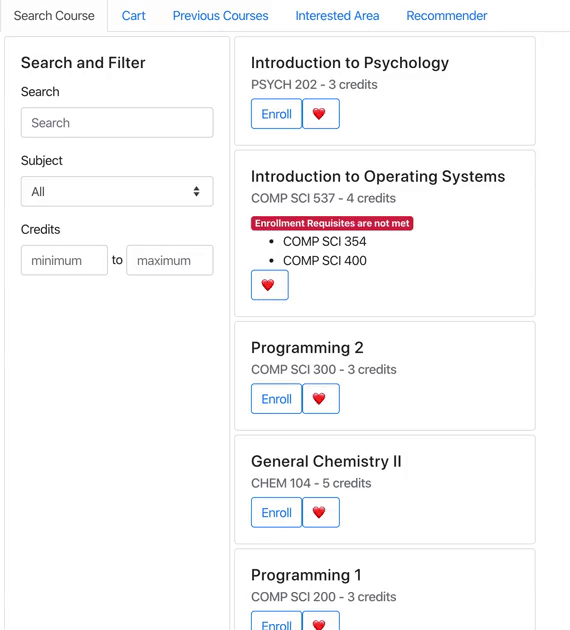
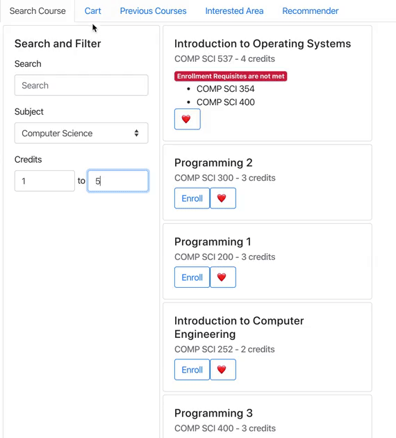
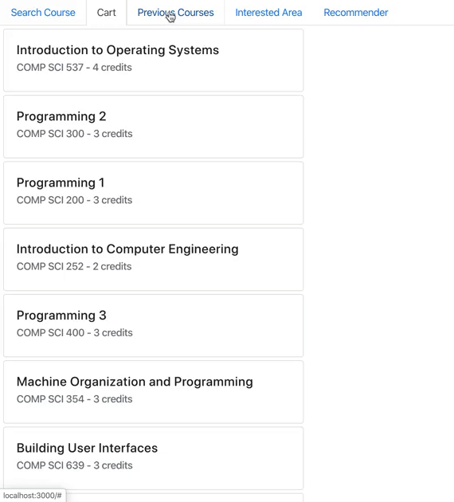
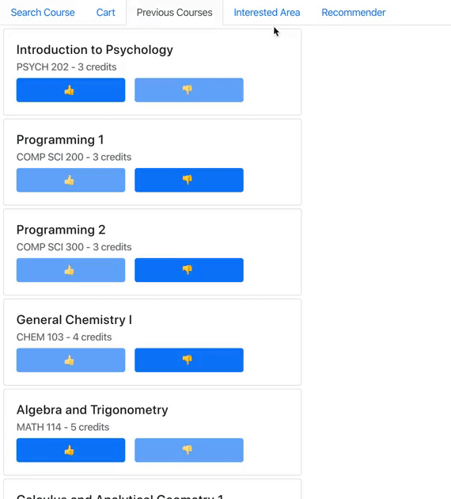
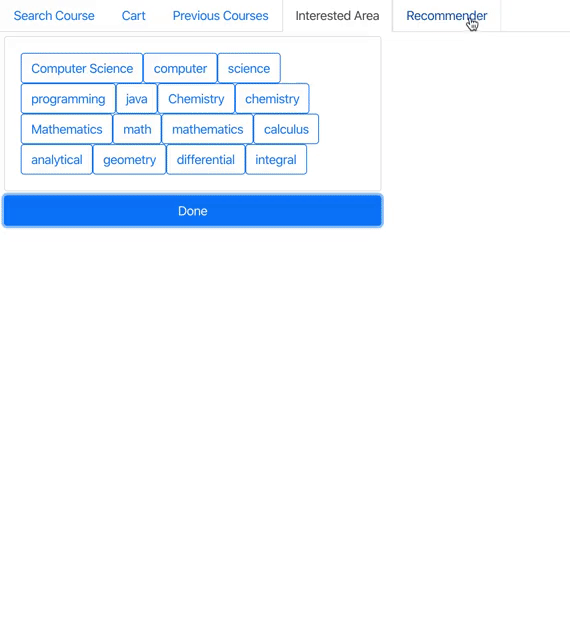

# Class Recommender
A React website to search all the courses, the previously taken courses, and recommended of classes and subjects based on user's interested.

## Search Course
The search bar allows user to filter the courses based on the name, subject and credits

## Cart
Show all enrolled courses 

## Previous Courses
Show all the previously taken classes and allow user to rate the class. 
The rating will later be used to generated a custom recommended class based on user's liked classes

## Interested Area
List of all the keywords for user to selected their preference on the interested subjects

## Recommender
List of all recommended class based on user's liked classes and interested subjects

